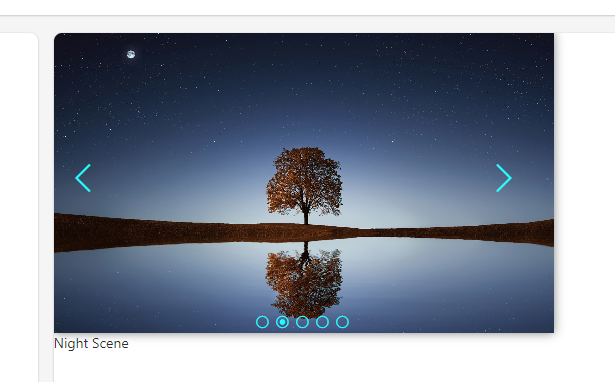

# My PCF Component

The <b>ImageSliderPCF </b> is a custom Power Apps component framework (PCF) virtual control built with TypeScript and React.

The control provides a smoother transitioning image gallery, then the OOB galleries within power apps.

----

The PCF is based around the ImageSlider tutorial from [WebDevSimplified](https://www.youtube.com/watch?v=Kx8XlKRBZx8&ab_channel=WebDevSimplified). The code for Kyle's repo is [here](https://github.com/WebDevSimplified/react-image-slider).

To keep in line with current Microsoft theming, I've replaced all the <i>Lucide</i> icons with FluentUI FontIcons

```
import { Icon } from '@fluentui/react/lib/Icon'
import { mergeStyles, mergeStyleSets } from '@fluentui/react/lib/Styling';
```

## Configuration

### Properties


- ImageSliderProps accepts 3 elements
    1. ImageSlider[]
    2. Width
    3. IconColour (this defaults to rgba(25,255,255)
- The ImageSliderItem is also comprised of 3 elements
  1. id; generated from the recordId
  2. imageUrl (required), a url to the image
  3. name (optional) 

ImageUrl and ImageName will need to have a column assigned in the Canvas app.

## Installation

Clones the repo

```
 git clone https://github.com/SPWareing/ImageSliderPCF.git

cd ImageSliderPCF
```
Push the PCF to your required environment

```
pac pcf push -pp samples

```
<i><b>NB</b> A Publisher Prefix of samples is suggested for testing components. The PCF can be packaged as a solution when testing has been satisified</i>

### Add the component to a Canvas App

Upon adding to a canvas the control will default to the following image


Without a default image the control errors and does not mount. Once The PCF has mounted, the image(s) can be changed to a collection/datasource and should render similar to the below.




